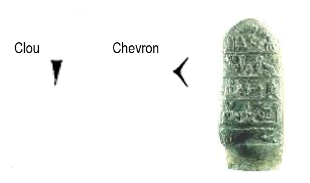
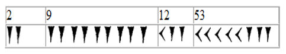
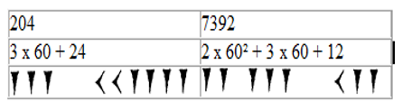

I--
author: Jean-Louis ORFILA 
title: Partie 1_Encodages 📝
---

## I. Les babyloniens :

{ width=30% }

Chez les Babyloniens (environ 2000 ans av.J.C.), les symboles utilisés sont le clou pour l’unité et le chevron pour les dizaines. Le système est additif jusqu’à 60.

Cette numération est dite de position, car le nombre  dépend de la position des symboles utilisés.
{ width=40% }
A partir de 60, la position des symboles entre en jeu de la façon suivante :
{ width=40% }

### Comment comptaient-ils sur leurs doigts ?
 Le pouce d’une main comptait les phalanges des quatre autres doigts (soit un maximum de 12) ; une fois le maximum atteint, un doigt de l’autre main « retenait » ce 12, si bien qu’au total avec les deux mains, cela fait 5 x 12 = 60.

[Exercice 1](https://docs.google.com/forms/d/1jevHPznkS8qgnYR-nQASILO8r5Rvxi39_CDHSx2MhtU){ .md-button target="_blank" rel="noopener" }

[Exercice 1-bis](https://learningapps.org/p18umkwg223){ .md-button target="_blank" rel="noopener" }

[Exercice romain - Qui veut gagner des millions ?](https://learningapps.org/611416){ .md-button target="_blank" rel="noopener" }

## II. Les mayas

## III. Les romains

### 1. Le bit

L'histoire ...?
!!! info
Un circuit ...
https://capytale2.ac-paris.fr/web/c/0ed0-1761126/meo
